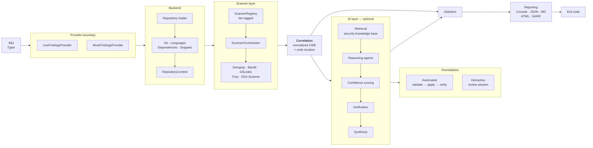
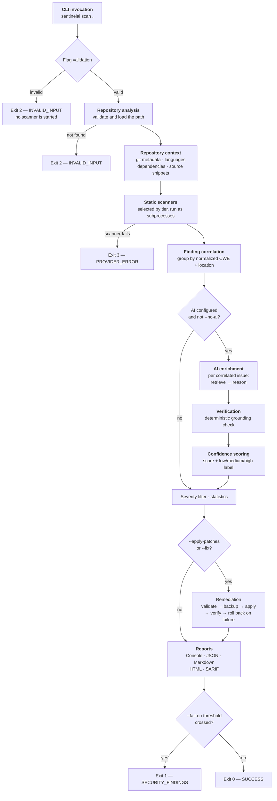
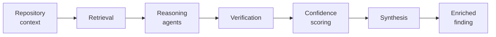

<div align="center">

# SentinelAI

**An AI-augmented DevSecOps command-line scanner that correlates findings from five security tools into single issues, explains them with a locally hosted model, and reports the result as JSON, Markdown, HTML, or SARIF.**

[](https://github.com/tanayaparalkar/capstone/actions/workflows/ci.yml)
[](LICENSE)
[](https://www.python.org/)
[](https://docs.oasis-open.org/sarif/sarif/v2.1.0/sarif-v2.1.0.html)
[](sentinelai-cli/tests)

[Overview](#overview) · [Architecture](#system-architecture) · [Installation](#installation) · [CLI Reference](#cli-reference) · [AI Pipeline](#ai-pipeline) · [CI/CD](#cicd)

</div>

---

## Overview

### The problem

Security teams run several scanners because no single tool covers enough ground. Doing so introduces problems that the tools themselves do not solve:

- **The same defect is reported more than once.** A single SQL injection is commonly flagged by one scanner at the line that builds the query string and by another at the next line that executes it — two alerts describing one problem.
- **Scanners do not share a vocabulary.** Semgrep labels nearly every rule `security`; Bandit files several unrelated checks under `blacklist`. Rule categories cannot be used to decide whether two findings describe the same issue.
- **A rule ID is not an explanation.** `B608` and a line number do not tell a developer why the code is reachable, what an attacker would do with it, or how to fix it.
- **Failures can look like successes.** A pipeline that treats a missing or crashed scanner as "no findings" converts a broken scan into a passing build.

### How SentinelAI addresses it

SentinelAI runs the scanners as subprocesses, parses their documented JSON output into one shared contract, and then does the work the tools leave undone:

1. **Correlation.** Findings are grouped into single issues using normalized CWE identifiers and code locations, so one defect is reported once — without discarding any raw finding.
2. **Explanation.** An optional AI layer, backed by a **local** Ollama model, produces an explanation, exploit narrative, impact assessment, and remediation for each correlated issue.
3. **Grading.** Every enrichment receives a confidence score and passes through a verification stage that is **deterministic Python, not a second model call**.
4. **Enforcement.** A severity threshold maps findings onto process exit codes so a pipeline can gate on the result.

> [!IMPORTANT]
> The deterministic core is fully functional without the AI layer. Scanning, correlation, statistics, reporting, exit codes, patch validation, backup, and rollback contain no model call. AI enrichment activates only when it is explicitly configured.

---

## Key Features

| Feature | Description |
|---|---|
| **Five integrated scanners** | Semgrep, Bandit, and GitLeaks in the core tier; Trivy and OSV-Scanner in the extended tier. Each runs as a subprocess and is parsed from its documented JSON output. |
| **Two scanner tiers** | The core tier runs by default. `--extended` adds dependency scanning. Tier selection is independent of scan mode. |
| **Cross-scanner correlation** | Findings are grouped by normalized CWE plus file and line proximity, joined transitively so grouping is independent of input order. |
| **Fail-closed orchestration** | A scanner that is missing or fails aborts the scan with a distinct exit code rather than reporting fewer findings. |
| **Deterministic output** | Correlation and statistics involve no randomness or I/O, so the same commit produces the same report. |
| **Local AI enrichment** | Multi-agent reasoning over a locally hosted Ollama model. No API keys are used and no source code leaves the machine. |
| **Retrieval-augmented grounding** | Reasoning is grounded in a bundled security knowledge base retrieved by embedding similarity. |
| **Deterministic verification** | A non-model grounding check marks each enrichment `verified`, `rejected`, or `insufficient_evidence`. |
| **Confidence scoring** | Each enriched finding carries a numeric score and a `low` / `medium` / `high` label. |
| **Automated remediation** | Structured patches are validated, backed up, applied atomically, verified, and rolled back automatically if verification fails. |
| **Interactive remediation** | `sentinelai fix` presents each vulnerability as a narrated card with a syntax-highlighted diff and per-finding approval. |
| **Five output formats** | Console, JSON, Markdown, HTML, and SARIF 2.1.0. |
| **Re-render without re-scanning** | `sentinelai report` converts a saved JSON result into any other format. |
| **Pipeline security gate** | `--fail-on <severity>` maps findings onto exit code 1. |
| **Reproducible container** | Every scanner is pinned by version and verified by checksum. The image runs as a non-root user against a read-only mount. |

---

## System Architecture



---

## End-to-End Execution Pipeline



> [!NOTE]
> Flag validation runs before any scanner subprocess starts, so an invalid invocation returns immediately rather than after a full scan.

---

## Project Structure

```
capstone/
├── sentinelai-cli/            The CLI application
│   ├── sentinelai/            Application source
│   ├── tests/                 Test suite
│   ├── docs/CONTRACTS.md      Data contracts exchanged between layers
│   └── README.md              Full CLI manual
├── sentinelai-manual-test/    Intentionally vulnerable benchmark fixture
├── .github/workflows/         GitHub Actions workflows
├── Dockerfile                 Version-pinned container image
├── PAPER_RESULTS.md           Recorded measurements
└── LICENSE                    MIT
```

Within `sentinelai-cli/sentinelai/`:

| Package | Responsibility |
|---|---|
| `contracts/` | Pydantic models exchanged between every layer |
| `backend/` | Repository loading and context extraction |
| `scanners/` | Scanner integrations, registry, and orchestrator |
| `correlation/` | Cross-scanner finding correlation |
| `ai/` | Retrieval, reasoning agents, confidence scoring, verification |
| `security_kb/` | Bundled security knowledge base |
| `patching/` | Automated patch validation, application, and rollback |
| `patcher/` | Interactive remediation session |
| `reporting/` | JSON, Markdown, HTML, and SARIF renderers |
| `presentation/` | Console rendering, narration, progress display |
| `providers/` | The findings-provider boundary |
| `statistics/` | Severity and confidence aggregation |
| `core/` | Exit codes, severity handling, errors, observability |

---

## Installation

### Prerequisites

| Requirement | Purpose |
|---|---|
| Python 3.9 or later | Runtime |
| Semgrep, Bandit, GitLeaks | Core scanner tier |
| Trivy, OSV-Scanner | Extended tier only (optional) |
| [Ollama](https://ollama.com) | AI enrichment only (optional) |

### Clone

```bash
git clone https://github.com/tanayaparalkar/capstone.git
cd capstone
```

### Install the scanners

```bash
pip install semgrep bandit
brew install gitleaks                 # Linux: see github.com/gitleaks/gitleaks
brew install trivy osv-scanner        # optional, extended tier
```

### Install the CLI

```bash
cd sentinelai-cli
python3 -m venv .venv
source .venv/bin/activate             # Windows: .venv\Scripts\activate
pip install -e .
```

### Dependencies

| Package | Role |
|---|---|
| `typer` | Command-line interface |
| `rich` | Terminal rendering |
| `pydantic` (v2) | Data contracts and validation |
| `jinja2` | HTML report templating |
| `GitPython` | Repository metadata |

Development extras (`pip install -e ".[dev]"`) add `pytest`, `pyyaml`, and `jsonschema`.

### Docker

```bash
docker build -t sentinelai:local .

mkdir -p sentinelai-output
docker run --rm \
  -v "$(pwd):/workspace:ro" \
  -v "$(pwd)/sentinelai-output:/output" \
  sentinelai:local \
  scan /workspace --format json --output /output/scan-result.json
```

The image is built on `python:3.12-slim-bookworm` and pins GitLeaks 8.30.1, Trivy 0.74.0, OSV-Scanner 2.5.1, Semgrep 1.172.0, and Bandit 1.9.4, verifying downloads by checksum. It runs as an unprivileged user (uid 1000). The scanned repository is mounted read-only and reports are written to a separate writable mount.

---

## Quick Start

```bash
# Scan the bundled vulnerable fixture
sentinelai scan sentinelai-manual-test
```

```bash
# Save a scan, then re-render it without scanning again
sentinelai scan . --format json --output scan-result.json
sentinelai report scan-result.json --format html --output report.html
sentinelai report scan-result.json --format sarif --output results.sarif
```

```bash
# Gate a pipeline: exit 1 if anything is high severity or above
sentinelai scan . --fail-on high
```

```bash
# Include dependency scanning
sentinelai scan . --extended
```

<details>
<summary><b>Enabling AI enrichment (optional)</b></summary>

```bash
ollama pull llama3.1:8b
ollama pull nomic-embed-text

export SENTINELAI_AI_LLM_MODEL=llama3.1:8b
export SENTINELAI_AI_EMBEDDING_MODEL=nomic-embed-text

sentinelai scan sentinelai-manual-test --ai
```

Enrichment activates only when **both** variables are set. `--ai` requires it and fails immediately if it is not configured; `--no-ai` forces a scanner-only run.

</details>

---

## CLI Reference

### Global options

| Option | Description |
|---|---|
| `--debug` | Show full tracebacks on unexpected errors instead of a one-line message |
| `--help` | Show help and exit |

### `sentinelai scan`

Scan a repository for vulnerabilities.

```bash
sentinelai scan [OPTIONS] [PATH]
```

| Option | Description |
|---|---|
| `--quick` | Run a quick scan (subset of checks) |
| `--full` | Run a full scan (all checks) |
| `--extended` | Also run the dependency scanners (Trivy, OSV-Scanner) |
| `--format` | Output format: `terminal` (default), `json`, `markdown`, `html`, `sarif` |
| `--output`, `-o` | Write the report to a file instead of printing it |
| `--severity`, `-s` | Display only findings at or above `low`, `medium`, `high`, or `critical` |
| `--fail-on` | Exit 1 at or above this severity: `low`, `medium`, `high`, `critical`, or `none` |
| `--details`, `-d` | Show the full detail view for one finding ID (terminal format only) |
| `--ai` | Require AI enrichment; fail if it is not configured |
| `--no-ai` | Skip AI enrichment |
| `--apply-patches` | Write AI-proposed fixes into the repository (off by default) |
| `--dry-run` | With `--apply-patches` or `--fix`, report what would change without writing |
| `--fix` | Interactively review and apply recommended fixes |
| `--interactive`, `-i` | Alias for `--fix` |
| `--yes`, `-y` | Apply all recommended fixes without asking for confirmation |

> [!NOTE]
> `--quick` and `--full` are mutually exclusive, as are `--ai` and `--no-ai`. `--dry-run` requires either `--apply-patches` or `--fix`.

### `sentinelai fix`

Scan a repository, narrate detected vulnerabilities, and interactively apply fixes.

```bash
sentinelai fix [OPTIONS] [PATH]
```

| Option | Description |
|---|---|
| `--quick` | Run a quick scan (subset of checks) |
| `--full` | Run a full scan (all checks) |
| `--extended` | Also run the dependency scanners |
| `--ai` | Require AI enrichment (local Ollama server) |
| `--no-ai` | Skip AI enrichment for a deterministic, rule-based fix run |
| `--severity`, `-s` | Only review findings at or above this severity |
| `--yes`, `-y` | Apply all recommended fixes without asking for confirmation |
| `--dry-run` | Simulate the remediation session without modifying files |

During the session each finding is presented as a card and the prompt accepts `[y]es`, `[n]o`, `[a]ll`, `[s]kip`, `[d]etails`, and `[q]uit`.

### `sentinelai undo`

Revert the most recent set of code changes applied by SentinelAI remediation.

```bash
sentinelai undo [PATH]
```

Takes no options other than `--help`. If no recent backup session exists, the command reports that and makes no changes.

### `sentinelai report`

Render an existing saved scan result as a report.

```bash
sentinelai report [OPTIONS] RESULT_FILE
```

| Option | Description |
|---|---|
| `--format`, `-f` | Output format: `json`, `markdown`, `html`, `sarif` |
| `--output`, `-o` | Write the report to this file instead of printing it |

> [!TIP]
> `report` re-renders a saved result and never re-scans, so SARIF and HTML artifacts are guaranteed to describe the same scan.

### `sentinelai version`

Show the SentinelAI CLI version.

### Exit codes

| Code | Name | Meaning |
|---|---|---|
| `0` | `SUCCESS` | Scan completed; nothing crossed the threshold |
| `1` | `SECURITY_FINDINGS` | Findings at or above `--fail-on` |
| `2` | `INVALID_INPUT` | Bad path or incompatible flags |
| `3` | `PROVIDER_ERROR` | A scanner or provider failed |
| `4` | `INTERNAL_ERROR` | Unexpected internal failure |

---

## Scanner Pipeline

All five scanners are registered in one place, each tagged with the tier it belongs to, so *which scanners exist* and *which scanners run* remain separate decisions.

| Scanner | Tier | Detects |
|---|---|---|
| **Semgrep** | Core | Source-code vulnerability patterns |
| **Bandit** | Core | Python-specific weaknesses |
| **GitLeaks** | Core | Hardcoded secrets and credentials |
| **Trivy** | Extended | Dependency vulnerabilities |
| **OSV-Scanner** | Extended | Manifest vulnerabilities, discovered recursively |

**Orchestration.** The registry returns scanners in a deterministic order. The orchestrator invokes each one against the repository context and concatenates the results into a single list of findings. If any scanner is unavailable or exits unexpectedly, the run **fails closed** with exit code 3 instead of returning a partial result.

**Correlation.** Raw findings are then grouped into issues. Because the scanners emit CWE identifiers in different shapes, each is normalized to a bare `CWE-<number>` before comparison. Two findings join the same group when they share a normalized CWE, refer to the same file, and sit within a small line tolerance of one another — which accommodates the common case of two tools blaming adjacent lines for the same defect. Grouping is transitive and order-independent.

Correlation is **additive**: the grouped view is added to the result, and every raw finding remains available in the output.

> [!NOTE]
> Dependency findings describe a package rather than a line of code, so they carry no line number and are reported as single-scanner issues.

---

## AI Pipeline

The AI layer is optional and runs entirely against a locally hosted model.



### Repository context

Before reasoning begins, the backend extracts structured knowledge about the repository: git metadata, detected languages ordered by file count, declared dependencies parsed from `requirements.txt` and `pyproject.toml`, and source snippets. A windowed excerpt of the source surrounding each finding is also extracted, so reasoning operates on real code rather than on a scanner's message string alone. The window size is configurable.

### Retrieval

A bundled security knowledge base covers common vulnerability classes, each entry describing a vulnerable pattern, the conditions under which it becomes exploitable, standard remediation guidance, and external references. Entries are embedded using a locally hosted embedding model and retrieved by cosine similarity against a query built from the finding and its repository context. Retrieval depth is configurable.

### Prompting and reasoning

Reasoning proceeds through a small number of specialised stages — establishing what the evidence supports, assessing exploitability and remediation together, and then critically reviewing that assessment. Enrichment runs **once per correlated issue rather than once per raw finding**, so duplicate reports of one defect do not multiply the cost.

Each stage requests output constrained to a declared schema, and generation uses a temperature of zero. Assembly of the final record is ordinary Python and makes no model call.

If enrichment fails for an individual finding, the failure is logged and the run continues with the remaining findings.

### Verification

Every enrichment passes through a verification stage that is **deterministic Python**, not a second model call. It assesses whether the model's output is grounded in the finding's own evidence and returns one of three statuses:

| Status | Meaning |
|---|---|
| `verified` | The response is grounded in the finding's evidence |
| `rejected` | The response is not grounded in the finding's evidence |
| `insufficient_evidence` | There is not enough concrete evidence to make the judgement |

Verification can be disabled by configuration; when disabled, findings are reported as `unverified`.

### Confidence scoring

Scoring is deterministic and combines retrieval relevance with the strength of the evidence attached to the finding. The result is a numeric score between 0.0 and 1.0 plus a `low`, `medium`, or `high` label, with both thresholds configurable.

<details>
<summary><b>Configuration reference</b></summary>

All AI settings are read from `SENTINELAI_AI_*` environment variables.

| Variable | Default |
|---|---|
| `SENTINELAI_AI_LLM_MODEL` | *(unset — required to enable enrichment)* |
| `SENTINELAI_AI_EMBEDDING_MODEL` | *(unset — required to enable enrichment)* |
| `SENTINELAI_AI_LLM_HOST` | `http://localhost:11434` |
| `SENTINELAI_AI_RETRIEVAL_TOP_K` | `5` |
| `SENTINELAI_AI_CONFIDENCE_HIGH_THRESHOLD` | `0.75` |
| `SENTINELAI_AI_CONFIDENCE_MEDIUM_THRESHOLD` | `0.4` |
| `SENTINELAI_AI_ENABLE_VERIFICATION` | `true` |
| `SENTINELAI_AI_CODE_CONTEXT_LINES` | `20` |
| `SENTINELAI_AI_REQUEST_TIMEOUT_SECONDS` | `120.0` |
| `SENTINELAI_AI_MAX_ATTEMPTS` | `2` |
| `SENTINELAI_AI_LOG_LEVEL` | `INFO` |

</details>

---

## Reporting

| Format | Description |
|---|---|
| **Console** | Rich-rendered tables with severity colouring, a scan header, statistics, and a per-finding detail view via `--details` |
| **JSON** | The complete machine-readable result: repository metadata, scan metadata, statistics, raw findings, correlated groups, AI enrichment, and patch application. Carries an explicit schema version. |
| **HTML** | A self-contained report rendered from a Jinja2 template, suitable for sharing or archiving as a CI artifact |
| **SARIF** | SARIF 2.1.0 for GitHub code scanning and other SARIF-aware tooling. The test suite validates emitted documents against the official OASIS SARIF 2.1.0 schema. |
| **Markdown** | A portable summary for pull-request comments and documentation |

SARIF severity levels are derived solely from finding severity; AI confidence never influences them.

Because `sentinelai report` renders from a saved JSON result, a pipeline can scan once and emit every other format from that single scan.

---

## CI/CD

Three GitHub Actions workflows are defined.

| Workflow | Trigger | Purpose |
|---|---|---|
| `ci.yml` | push, pull request | Runs the test suite, then runs SentinelAI against this repository |
| `nightly.yml` | schedule, manual | Test matrix across Python 3.9 and 3.12, Docker image build validation, and an extended-tier scan |
| `ai-validation.yml` | manual only | AI enrichment validation |

`ci.yml` demonstrates the complete DevSecOps loop and requires **no secrets of any kind**:

1. Install the CLI and run the test suite.
2. Install the pinned core scanners.
3. Scan the repository once, saving a JSON snapshot and applying a `--fail-on high` gate.
4. Generate SARIF and HTML from that saved result, without re-scanning.
5. Upload all reports as build artifacts regardless of outcome.
6. Evaluate the recorded exit code.

The evaluation step distinguishes a **security outcome** from a **tool failure**: exit 1 reports that findings crossed the configured threshold, while exits 2, 3, and 4 report that SentinelAI itself could not complete its work. The two are surfaced differently rather than collapsed into a single red build.

### Using SentinelAI in your own pipeline

```yaml
- name: Run SentinelAI security gate
  run: |
    sentinelai scan . --format sarif --output results.sarif --fail-on high

- name: Upload SARIF to GitHub code scanning
  if: always()
  uses: github/codeql-action/upload-sarif@v3
  with:
    sarif_file: results.sarif
```

---

## Technology Stack

| Layer | Technology |
|---|---|
| Language | Python 3.9+ |
| CLI framework | Typer (built on Click) |
| Terminal rendering | Rich |
| Data contracts | Pydantic v2 |
| Templating | Jinja2 |
| Repository metadata | GitPython |
| Testing | pytest |
| Static analysis | Semgrep, Bandit, GitLeaks |
| Dependency analysis | Trivy, OSV-Scanner |
| Model runtime | Ollama (local HTTP) |
| Container base | `python:3.12-slim-bookworm` |
| Continuous integration | GitHub Actions |
| Interchange format | SARIF 2.1.0 |

---

## Repository Architecture

| Module | Responsibility |
|---|---|
| **`contracts`** | Defines every model exchanged between layers: scanner findings, correlated findings, AI-enriched findings, structured patches, scan results, and scan metadata. It is a leaf package with no dependencies on the layers that consume it. |
| **`backend`** | Validates and loads a repository path, then extracts git metadata, languages, dependencies, and source snippets, bundling them into a repository context. Also extracts the windowed source excerpt used during reasoning. |
| **`scanners`** | One integration module per tool, a registry that tags each scanner with its tier, and an orchestrator that runs the selected set and fails closed on error. |
| **`correlation`** | Groups raw findings into issues using normalized CWE identifiers and code locations. Pure computation with no I/O or configuration lookup. |
| **`ai`** | The optional intelligence layer: retrieval, reasoning agents, prompt construction, confidence scoring, verification, and synthesis, plus the model and embedding clients and their configuration. |
| **`security_kb`** | The bundled security knowledge base and its loader. |
| **`patching`** | Deterministic patch handling for `--apply-patches`: pre-flight validation, backup, atomic application, verification, and automatic rollback. |
| **`patcher`** | The interactive remediation session behind `fix` and `undo`, including patch extraction, application, verification, and snapshot restore. |
| **`reporting`** | Renderers for JSON, Markdown, HTML, and SARIF, plus the loader that reads a saved result back. |
| **`presentation`** | Console output: headers, findings tables, summaries, progress display, and the interactive narrator. |
| **`providers`** | The abstraction the CLI depends on for obtaining a scan result, with a live implementation and a mock implementation. |
| **`statistics`** | Aggregates severity counts, scanner counts, category counts, correlation counts, and confidence distribution. |
| **`core`** | Exit codes, severity filtering and threshold evaluation, error types, output formatting, and observability helpers. |

---

## Team Responsibilities

Module ownership as documented in the source code:

| Area | Owner | Modules |
|---|---|---|
| Repository analysis and scanner integration | **Nitaanth** | `backend`, `scanners` |
| AI reasoning, retrieval, and knowledge base | **Tanaya** | `ai`, `security_kb` |
| CLI, reporting, and presentation | **Viraj** | `main.py`, `reporting`, `presentation` |

> [!NOTE]
> This table reflects intended module ownership as recorded in source-code documentation.

---

## Performance Characteristics

Measured on the bundled `sentinelai-manual-test` benchmark fixture (5 scanned files) using the core scanner tier in standard mode.

| Metric | Value |
|---|---|
| Raw scanner findings | 23 |
| Correlated issues | 16 |
| Issues confirmed by more than one scanner | 4 |
| Findings by scanner | Bandit 11, Semgrep 11, GitLeaks 1 |
| Severity distribution | 0 critical / 9 high / 11 medium / 3 low |
| Scan duration (n=5) | min 3.04 s · median 3.13 s · mean 3.26 s · max 3.74 s |

AI enrichment latency recorded in [`PAPER_RESULTS.md`](PAPER_RESULTS.md) — measured on an earlier revision of the fixture that produced 17 findings — was a mean of 144.4 s across three runs, approximately 8.5 s per finding, with all enrichments completing in every run.

> [!NOTE]
> These figures depend on hardware, scanner versions, and the repository under analysis. Run `sentinelai scan sentinelai-manual-test` to reproduce the scanner-only measurements locally.

---

## Future Scope

The following are **planned directions, not implemented functionality**:

- Expanding the bundled security knowledge base and persisting the vector index between runs instead of rebuilding it in memory.
- Deduplicating results across the two dependency scanners so an extended-tier count reports distinct vulnerabilities rather than raw findings.
- Extending correlation to dependency findings, which is not currently possible because they carry no line numbers.
- Broadening the verification stage beyond its current grounding heuristic.
- Running the extended scanner tier on every pull request, in addition to the existing nightly run.
- Supporting additional model runtimes alongside Ollama.

---

## License

Released under the [MIT License](LICENSE).

---

## Acknowledgements

SentinelAI orchestrates rather than reimplements. It is built on the work of these projects:

- [Semgrep](https://semgrep.dev) — static analysis across many languages
- [Bandit](https://bandit.readthedocs.io) — Python security linting
- [GitLeaks](https://github.com/gitleaks/gitleaks) — secret detection
- [Trivy](https://trivy.dev) — dependency and container vulnerability scanning
- [OSV-Scanner](https://google.github.io/osv-scanner/) — vulnerability matching against the OSV database
- [Ollama](https://ollama.com) — local model runtime
- [OASIS SARIF](https://docs.oasis-open.org/sarif/sarif/v2.1.0/sarif-v2.1.0.html) — the static analysis interchange format

Built with [Typer](https://typer.tiangolo.com), [Rich](https://rich.readthedocs.io), and [Pydantic](https://docs.pydantic.dev).

<div align="center">

**SentinelAI reports what the underlying tools detect. A clean scan is not proof that a repository is secure.**

</div>
